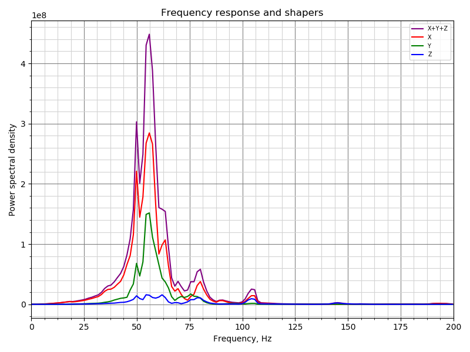
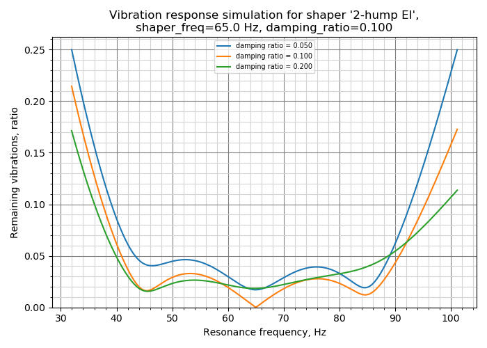
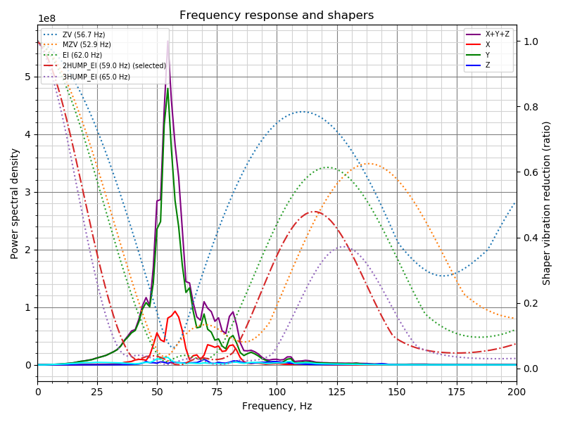

Measuring Resonances
====================

This branch provides a support for ADXL345 accelerometer, which can be used to
measure resonance frequencies of the printer for different axes, and auto-tune
[input shapers](Resonance_Compensation.md) to compensate for resonances.
Note that using ADXL345 requires some soldering and crimping. Also note that
only Raspberry Pi setups have been tested at this time.


Installation instructions
===========================

## Wiring

You need to connect ADXL345 to your Raspberry Pi via SPI. Note that the I2C
connection, which is suggested by ADXL345 documentation, has too low throughput
and **will not work**. You can follow the wiring instructions from
[this](https://github.com/nagimov/adxl345spi#wiring) repo (just the wiring
part). Double-check your wiring before powering up the Raspberry Pi to prevent
damaging it or the accelerometer.

## Mounting the accelerometer

The accelerometer must be attached to the toolhead. One needs to design a proper
mount that fits their own 3D printer. It is better to align the axes of the
accelerometer with the printer's axes (but if it makes it more convenient,
axes can be swapped - i.e. no need to align X axis with X and so forth - it
should be fine even if Z axis of accelerometer is X axis of the printer, etc.).

An example of mounting ADXL345 on the SmartEffector:


Note that on a bed slinger printer one must design 2 mounts: one for the
toolhead and one for the bed, and run the measurements twice.

## Software installation

Note that resonance measurements and shaper auto-calibration require additional
dependencies not installed by default. You will have to run on your Raspberry Pi
```
$ ~/klippy-env/bin/pip install matplotlib
```
to install the missing dependencies.

Afterwards, follow the instructions in the
[RPi Microcontroller document](RPi_microcontroller.md) to setup the
"linux mcu" on the Raspberry Pi.

Make sure the Linux SPI driver is enabled by running `sudo
raspi-config` and enabling SPI under the "Interfacing options" menu.

Add the following to the printer.cfg file:
```
[mcu rpi]
serial: /tmp/klipper_host_mcu

[adxl345]
cs_pin: rpi:None

[resonance_tester]
accel_chip: adxl345
probe_points:
    100,100,20  # an example
```
It is advised to start with 1 probe point, in the middle of the print bed,
slightly above it.

Restart Klipper via the `RESTART` command.

Measuring the resonances
===========================

## Checking the setup

Now you can test a connection. In Octoprint, run `ACCELEROMETER_QUERY`. You
should see the current measurements from the accelerometer, including the
free-fall acceleration, e.g.
```
Recv: // adxl345 values (x, y, z): 470.719200, 941.438400, 9728.196800
```

Try running `MEASURE_AXES_NOISE` in Octoprint, you should get some baseline
numbers for the noise of accelerometer on the axes (should be somewhere
in the range of ~10-100).

## Measuring the resonances

Now you can run some real-life tests. In `printer.cfg` add or replace the
following values:
```
[printer]
max_accel: 7000
max_accel_to_decel: 7000
```
(after you are done with the measurements, revert these values to their old,
or the newly suggested values). Also, if you have enabled input shaper already,
you will need to disable it prior to this test as follows:
```
SET_INPUT_SHAPER SHAPER_FREQ_X=0 SHAPER_FREQ_Y=0
```
as it is not valid to run the resonance testing with the input shaper enabled.

Run the following command:
```
TEST_RESONANCES AXIS=X FIG_NAME=resonances.png
```
Note that it will create vibrations on X axis. If that works, run for Y axis
as well:
```
TEST_RESONANCES AXIS=Y FIG_NAME=resonances.png
```
This will generate 2 PNG charts (`/tmp/resonances_x_*.png` and
`/tmp/resonances_y_*.png`) and 2 files with the CSV data for those charts
(as some `/tmp/resonance_data_x_*.csv` and `/tmp/resonance_data_x_*.csv` files).
If you also need raw data from the accelerometer, you can add
`RAW_NAME=raw_data.csv` to the above commands (2 files `/tmp/raw_data_x_*.csv`
and `/tmp/raw_data_y_*.csv` will be written).

**Attention!** Be sure to observe the printer for the first time, to make sure
the vibrations do not become too violent (`M112` command can be used to abort
the test in case of emergency, hopefully it will not come to this though).
If the vibrations do get too strong, you can attempt to specify a lower than the
default value for `accel_per_hz` parameter in `[resonance_tester]` section, e.g.
```
[resonance_tester]
accel_chip: adxl345
accel_per_hz: 50  # default is 75
probe_points: ...
```

Generated charts show power spectral density of the vibrations depending on the
frequency. Usually, the charts are pretty much self-explanatory, with the peaks
corresponding to the resonance frequencies:



The chart above
shows the resonances for X axis at approx. 50 Hz, 56 Hz, 63 Hz, 80 Hz and
104 Hz and one cross-resonance for Y axis at ~ 56 Hz. From this, one can derive
that a good input shaper config in this case could be `2hump_ei` at around
`shaper_freq_y = 45` (Hz):

||
|:--:|
|Input Shaper response to vibrations, lower is better.|

Note that the smaller resonance at 104 Hz requires less of vibration suppression
(if at all).

## Input Shaper auto-calibration

Besides manually choosing the appropriate parameters for the input shaper
feature, it is also possible to run an experimental auto-tuning for the
input shaper.

In order to attempt to measure the resonance frequencies and automatically
determine the best parameters for `[input_shaper]`, run the following command
via Octoprint terminal:
```
SHAPER_CALIBRATE FIG_NAME=calibration.png
```

This will test all frequencies in range 5 Hz - 120 Hz and generate
`/tmp/calibration_x_*.png` and `/tmp/calibration_y_*.png` charts, as well as
the csv data for those charts (`/tmp/calibration_data_*.csv`). You will also
get the suggested frequencies for each input shaper, as well as which
input shaper is recommended for your setup. For example:


```
Fitted shaper 'zv' frequency = 56.7 Hz (vibrations = 23.2%)
Fitted shaper 'mzv' frequency = 52.9 Hz (vibrations = 10.9%)
Fitted shaper 'ei' frequency = 62.0 Hz (vibrations = 8.9%)
Fitted shaper '2hump_ei' frequency = 59.0 Hz (vibrations = 4.9%)
Fitted shaper '3hump_ei' frequency = 65.0 Hz (vibrations = 3.3%)
Recommended shaper_type_y = 2hump_ei, shaper_freq_y = 59.0 Hz
```
If you agree with the suggested parameters, you can execute `SAVE_CONFIG`
now to save them and restart the Klipper.


If your printer is a bed slinger printer, you will need to repeat the
measurements twice: measure the resonances of X axis with the accelerometer
attached to the toolhead and the resonances of Y axis - to the bed (the usual
bed slinger setup). In this case, you can specify the axis you want to run the
test for (by default the test is performed for both axes):
```
SHAPER_CALIBRATE AXIS=Y FIG_NAME=calibration.png
```

You can execute `SAVE_CONFIG` twice - after calibrating each axis.

However, if you connected two accelerometers simultaneously and configured them
in the following manner:
```
[adxl345 adxl345_x]
cs_pin: ...

[adxl345 adxl345_y]
cs_pin: ...

[resonance_tester]
accel_chip_x: adxl345_x
accel_chip_y: adxl345_y
probe_points: ...
```
then one can simply run `SHAPER_CALIBRATE` without specifying an axis to
calibrate the input shaper for both axes in one go.

After the autocalibration is finished, you will still need to choose the
`max_accel` value that does not create too much smoothing in the printed
parts. Follow [this](Resonance_Compensation.md#selecting-max_accel) part of
the input shaper tuning guide and print the test model.

## Input Shaper re-calibration

`SHAPER_CALIBRATE` can be also used to re-calibrate the input shaper in the
future, especially if some changes to the printer that can affect its kinematics
are made. One can either re-run the full calibration using `SHAPER_CALIBRATE`
command, or restrict the auto-calibration to a single axis by supplying `AXIS=`
parameter, like
```
SHAPER_CALIBRATE AXIS=X FIG_NAME=calibration.png
```

**Warning!** It is not advisable to run the shaper autocalibration very
frequently (e.g. before every print, or every day). In order to determine
resonance frequencies, autocalibration creates intensive vibrations on each of
the axes. Generally, 3D printers are not designed to withstand a prolonged
exposure to vibrations near the resonance frequencies. Doing so may increase
wear of the printer components and reduce their lifespan. There is also an
increased risk of some parts unscrewing or becoming loose. Always check that
all parts of the printer (including the ones that may normally not move) are
securely fixed after each auto-tuning.

Also, do to some noise in measurements, it is possible the the tuning results
will be slightly different from one calibration run to another one. Still, it
is not expected that the resulting print quality will be affected too much.
However, it is still advised to double-check the suggested parameters, and
print some test prints before using them to confirm they are good.